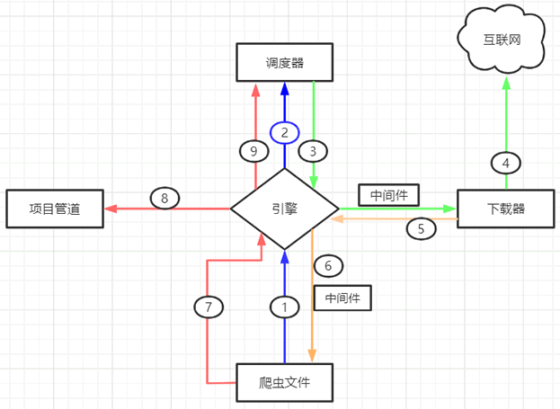

# Scrapy框架

## 安装
```shell
python -m pip install Scrapy
```

## 常用命令

```shell
scrapy startproject project_name  # 创建一个新项目
scrapy genspider spider_name domain  # 创建一个新爬虫
scrapy runspider spider_name  # 运行爬虫，不需要创建项目
scrapy crawl spider_name  # 运行爬虫，必须要创建项目
scrapy list # 列出项目下的爬虫
scrapy view url # 查看url页面
scrapy shell url # 打开shell
scrapy settings # 查看项目设置
```

## 第一个Scrapy爬虫项目
1. 创建项目
```shell
scrapy startproject Baidu
```

2. 创建一个爬虫
```shell
scrapy genspider Baidu www.baidu.com
```
打开项目可以看到一下结构
```shell
Baidu                   # 项目文件夹
├── Baidu               # 用来装载项目文件的目录
│   ├── items.py        # 定义要抓取的数据结构
│   ├── middlewares.py  # 中间件，用来设置一些处理规则
│   ├── pipelines.py    # 管道文件，处理抓取的数据
│   ├── settings.py     # 全局配置文件
│   └── spiders         # 用来装载爬虫文件的目录  
│       ├── baidu.py    # 具体的爬虫程序
└── scrapy.cfg          # 项目基本配置文件
```
## Scrapy爬虫工作流程

Scrapy 框架由五大组件构成，如下所示:
1. **Engine**: 负责调度、执行、管理爬虫，Engine 是整个框架的入口，它负责调度、执行、管理爬虫，Engine 是整个框架的入口，它负责调度、执行、管理爬虫。
2. **Scheduler**: 负责将请求调度到引擎，Scheduler 是引擎和下载器之间的一个中间件，它负责将请求调度到引擎，Scheduler 是引擎和下载器之间的一个中间件。
3. **Downloader**: 负责下载网页，Downloader 是引擎和下载器之间的一个中间件，它负责下载网页，Downloader 是引擎和下载器之间的一个中间件。
4. **Spider**: 负责解析网页，Spider 是引擎和下载器之间的一个中间件，它负责解析网页，Spider 是引擎和下载器之间的一个中间件。
5. **Item Pipeline**: 负责处理爬取的数据，Item Pipeline 是引擎和下载器之间的一个中间件，它负责处理爬取的数据，Item Pipeline 是引擎和下载器之间的一个中间件。

Scrapy 工作流程示意图如下所示：



上述示意图描述如下，当一个爬虫项目启动后，Scrapy 框架会进行以下工作：

第一步：由“引擎”向爬虫文件索要第一个待爬取的 URL，并将其交给调度器加入 URL 队列当中（对应图中1/2步骤）。

第二步：调度器处理完请求后， 将第一个 URL 出队列返回给引擎；引擎经由下载器中间件将该  URL 交给下载器去下载 response 对象（对应3/4步骤）。

第三步：下载器得到响应对象后，将响应结果交给引擎，引擎收到后，经由蜘蛛中间件将响应结果交给爬虫文件（对应5/6步骤）。

第四步：爬虫文件对响应结果进行处理、分析，并提取出所需要的数据。

第五步：最后，提取的数据会交给管道文件去存数据库，同时将需要继续跟进的二级页面 URL 交给调度器去入队列（对应7/8/9步骤）。

上述过程会一直循环，直到没有要爬取的 URL 为止，也就是 URL 队列为空时才会停止。

## settings配置文件
在使用 Scrapy 框架时，还需要对配置文件进行稍微改动。下面使用 Pycharm 打开刚刚创建的“Baidu”项目，对配置文件进行如下修改：
```
# 1、定义User-Agent
USER_AGENT = 'Mozilla/4.0 (compatible; MSIE 7.0; Windows NT 6.0)'
# 2、是否遵循robots协议，一般设置为False
ROBOTSTXT_OBEY = False
# 3、最大并发量，默认为16
CONCURRENT_REQUESTS = 32
# 4、下载延迟时间
DOWNLOAD_DELAY = 1
```

其余常用配置：
```
# 设置日志级别，DEBUG < INFO < WARNING < ERROR < CRITICAL
LOG_LEVEL = ' '
# 将日志信息保存日志文件中，而不在终端输出
LOG_FILE = ''
# 设置导出数据的编码格式(主要针对于json文件)
FEED_EXPORT_ENCODING = ''
# 非结构化数据的存储路径
IMAGES_STORE = '路径'
# 请求头，此处可以添加User-Agent、cookies、referer等
DEFAULT_REQUEST_HEADERS={
   'Accept': 'text/html,application/xhtml+xml,application/xml;q=0.9,*/*;q=0.8',
   'Accept-Language': 'en',
}
# 项目管道，300 代表激活的优先级 越小越优先，取值1到1000
ITEM_PIPELINES={
  'Baidu.pipelines.BaiduPipeline':300
}
# 添加下载器中间件
DOWNLOADER_MIDDLEWARES = {}
```